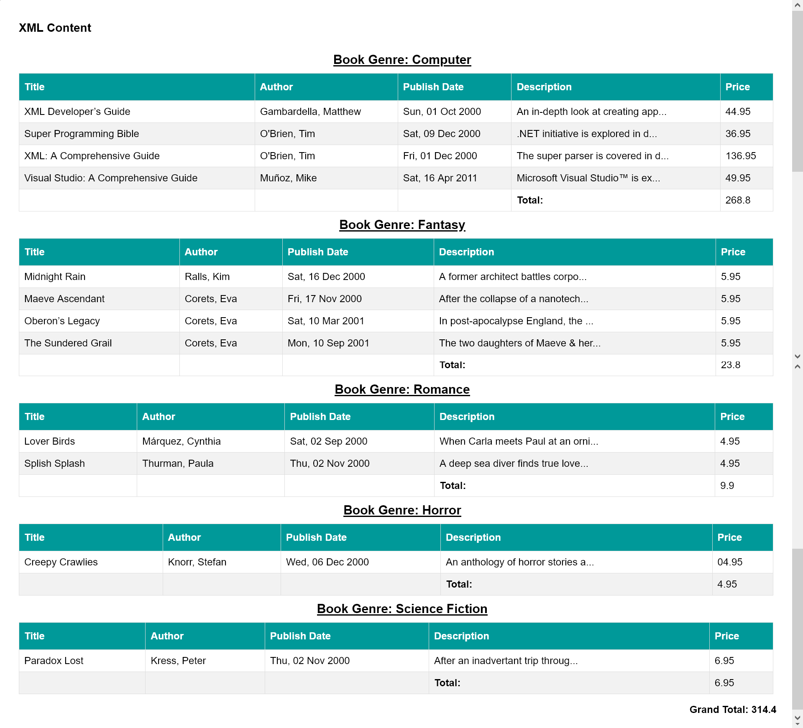

# Levart Test 1
**Scenario**
Take the included XML file ‘text.xml’ and use PHP to parse and output in the following html table format:
" Genre	Title	Author	Publish Date    Description	Price "

Key Point
•	The results should be ordered by Genre first, then Title.
•	Publish date should be represented as ‘Mon, 10 Feb  2014’ format.
•	Description should be limited to the closest full word around 32 chars and suffixed with an ellipsis.
•	Output should be html5 and be utf-8 encoded.
•	Under every Genre there should be a sum of the prices within that genre and a grand total at the bottom including a sum of all prices.

**DEVELOPMENT** 
I Use CodeIgniter as a framawor. It is a PHP full-stack web framework that is light, fast, flexible and secure.

More information can be found at the [official site](http://codeigniter.com).

I can also capable to do this without any framwork. 

## Structure
You will find the main controller file in "app/Home.php".
And view file in "Views/file_reader.php".
Your XML file is in public folder.

## Server Requirements

PHP version 7.3 or higher is required, with the following extensions installed:

## Thak you

## Layout

